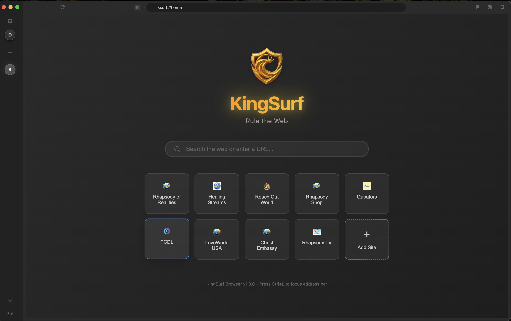

# KingSurf Browser

  

**Rule the Web**

A modern, secure web browser built with Electron and React

**[📥 Download Latest Release](https://github.com/emmacyril/kingsurf-dist/releases/latest)**

> **Note:** This is a public distribution repository for KingSurf Browser. The source code is maintained in a private repository. This repository contains documentation, assets, and release information for users and contributors.

## 📦 Download & Installation

### 🍎 **macOS**

#### **Intel Macs (x64)**

- **[DMG Installer](https://github.com/emmacyril/kingsurf-dist/releases/download/v1.0.0/kingsurf-1.0.0-mac-x64.dmg)** (117 MB)
  - SHA256: `d97a4a99e512d6debf12629062854895520eabb18406124fada5d9e040317df6`

#### **Apple Silicon (ARM64)**

- **[DMG Installer](https://github.com/emmacyril/kingsurf-dist/releases/download/v1.0.0/kingsurf-1.0.0-mac-arm64.dmg)** (110 MB)
  - SHA256: `b9afcb9647d9453261f06866ec5d21f9ca7782895e322a41a2efcf1e075d6dbb`

### 🪟 **Windows**

#### **Universal Installer (Recommended)**

- **[Universal Installer](https://github.com/emmacyril/kingsurf-dist/releases/download/v1.0.0/kingsurf-1.0.0-win.exe)** (176 MB)
  - SHA256: `e170449480a236965f0849ad972a8fa043fecfb4cf9fca3d30a78103298bb27d`
  - Supports both x64 and ARM64 architectures

#### **Architecture-Specific Installers**

- **[x64 Installer](https://github.com/emmacyril/kingsurf-dist/releases/download/v1.0.0/kingsurf-1.0.0-win-x64.exe)** (87.8 MB)
  - SHA256: `ccc6ba8f39eb716a7990489dfdef01060f79439495bcb254da17600992ec0542`
- **[ARM64 Installer](https://github.com/emmacyril/kingsurf-dist/releases/download/v1.0.0/kingsurf-1.0.0-win-arm64.exe)** (88.9 MB)
  - SHA256: `2da5978cac3e50455c5faa4c6df8a3d4499d5b40b563c80137c0a226887efcf3`

### 🐧 **Linux**

#### **x64 (AMD64)**

- **[AppImage](https://github.com/emmacyril/kingsurf-dist/releases/download/v1.0.0/kingsurf-1.0.0-linux-x86_64.AppImage)** (116 MB)
  - SHA256: `ac40c16804992ec8b0d94dff7de8c88f2278b9a983098dcf18f3b929c31899a6`
- **[DEB Package](https://github.com/emmacyril/kingsurf-dist/releases/download/v1.0.0/kingsurf-1.0.0-linux-amd64.deb)** (79 MB)
  - SHA256: `ce223286c3d7ec874667f95a6a108c94f1ad8ac31069a0718bc31466abfe4840`

#### **ARM64**

- **[AppImage](https://github.com/emmacyril/kingsurf-dist/releases/download/v1.0.0/kingsurf-1.0.0-linux-arm64.AppImage)** (116 MB)
  - SHA256: `728e8c8c520e9042468691438d5d2ae4068fc521ded4b0e2ae9e0eb29946e504`
- **[DEB Package](https://github.com/emmacyril/kingsurf-dist/releases/download/v1.0.0/kingsurf-1.0.0-linux-arm64.deb)** (74.1 MB)
  - SHA256: `dc717f60d40445740eed3b8f95ce3db716e9dd105ffed2d78f4a2ae1b1e89613`

**[📋 View All Downloads & Checksums](https://github.com/emmacyril/kingsurf-dist/releases/latest)**

## � Installation Instructions

### 🍎 **macOS Installation**

1. Download the appropriate DMG file for your Mac architecture
2. Double-click the DMG file to mount it
3. Drag **KingSurf.app** to the Applications folder
4. Eject the DMG and launch KingSurf from Applications

### 🪟 **Windows Installation**

1. Download the appropriate EXE installer for your architecture
2. Run the installer and follow the setup wizard
3. KingSurf will be installed and added to Start Menu
4. Launch from Start Menu or desktop shortcut

### 🐧 **Linux Installation**

#### **AppImage (Recommended)**

1. Download the appropriate AppImage for your architecture
2. Make it executable: `chmod +x kingsurf-1.0.0-linux-*.AppImage`
3. Run directly: `./kingsurf-1.0.0-linux-*.AppImage`

#### **DEB Package (Debian/Ubuntu)**

1. Download the appropriate DEB file for your architecture
2. Install: `sudo dpkg -i kingsurf-1.0.0-linux-*.deb`
3. Fix dependencies if needed: `sudo apt-get install -f`
4. Launch from applications menu or run `kingsurf`

## �📸 Screenshots

  
  
<em>KingSurf Browser - Modern, secure web browsing with dark theme and intuitive interface</em>

## ✨ Features

### 🚀 Core Browser Features

- **Multi-tab browsing** with Chrome-style tab management
- **Modern UI** with dark theme and smooth animations
- **Expandable sidebar** with quick access to favorite sites
- **Address bar** with favicon display and URL validation
- **Navigation controls** (back, forward, reload, home)
- **Search modal** with quick access shortcuts

### 🔒 Security & Privacy

- **Sandboxed browsing** with context isolation
- **Web security** enabled by default
- **No remote module** for enhanced security
- **Secure URL validation** and protocol filtering

### ⚡ Performance

- **Hardware acceleration** enabled
- **Efficient memory management** with proper cleanup
- **Fast startup** with optimized loading
- **Cross-platform compatibility** (macOS, Windows, Linux)

### 🎨 User Experience

- **Chrome-style keyboard shortcuts** (Cmd/Ctrl+T, Cmd/Ctrl+W, etc.)
- **Native system menus** with full browser functionality
- **Window management** with proper close behavior
- **Favicon loading** with fallback handling
- **Responsive design** that adapts to screen sizes

## 🚀 Getting Started

KingSurf Browser is available as pre-built packages for all major platforms. Simply download the appropriate installer for your system from the links above and follow the installation instructions.

### System Requirements

- **macOS**: 10.15 (Catalina) or later
- **Windows**: Windows 10 or later (x64/ARM64)
- **Linux**: Ubuntu 18.04+ / Debian 10+ / Fedora 32+ or equivalent

## 📦 Distribution Packages

KingSurf creates professional installer packages for all platforms:

### macOS

- **DMG installer** (.dmg) - Drag and drop installation
- **ZIP archive** (.zip) - Portable version
- **Universal binaries** - Supports both Intel and Apple Silicon

### Windows

- **NSIS installer** (.exe) - Full Windows installer with uninstaller
- **ZIP archive** (.zip) - Portable version
- **Multi-architecture** - x64 and ARM64 support

### Linux

- **DEB package** (.deb) - For Debian/Ubuntu systems
- **RPM package** (.rpm) - For Red Hat/Fedora systems
- **AppImage** (.AppImage) - Portable Linux application

## 🏗️ Technology Stack

KingSurf Browser is built with modern web technologies:

- **Frontend**: React 19.1.0 + TypeScript
- **Backend**: Electron 37.2.0 (Main Process)
- **Styling**: Tailwind CSS 3.4.17
- **Build Tool**: Vite 5.4.19
- **Distribution**: electron-builder

## 📚 Documentation

- [Release Notes](RELEASE_NOTES.md) - Version history and changes
- [Keyboard Shortcuts](docs/KEYBOARD_SHORTCUTS.md) - Complete shortcut reference
- [Menu Implementation](docs/MENU_IMPLEMENTATION.md) - Native menu system
- [Window Management](docs/WINDOW_CLOSURE_BEHAVIOR.md) - Window behavior details
- [Additional Documentation](docs/) - Complete documentation collection

## 🤝 Contributing

This repository is for distribution and documentation purposes. For feature requests, bug reports, or contributions to the KingSurf Browser project:

1. **Bug Reports**: Create an issue with detailed information about the problem
2. **Feature Requests**: Open an issue describing the desired functionality
3. **Documentation**: Contributions to improve documentation are welcome via pull requests
4. **Feedback**: Share your experience and suggestions for improvement

**Note**: Source code contributions are handled through our private development repository.

## 📄 License

This project is licensed under the MIT License - see the [LICENSE](LICENSE) file for details.

## 🙏 Acknowledgments

- Built with [Electron](https://electronjs.org/)
- UI powered by [React](https://reactjs.org/)
- Styled with [Tailwind CSS](https://tailwindcss.com/)
- Icons from [Lucide React](https://lucide.dev/)

## 📞 Support

For support, please:

1. Check the [documentation](docs/)
2. Review [existing issues](../../issues)
3. Create a [new issue](../../issues/new) if needed

---

  <strong>KingSurf Browser - Rule the Web</strong> 
  Built with ❤️ by the KingSurf Team

